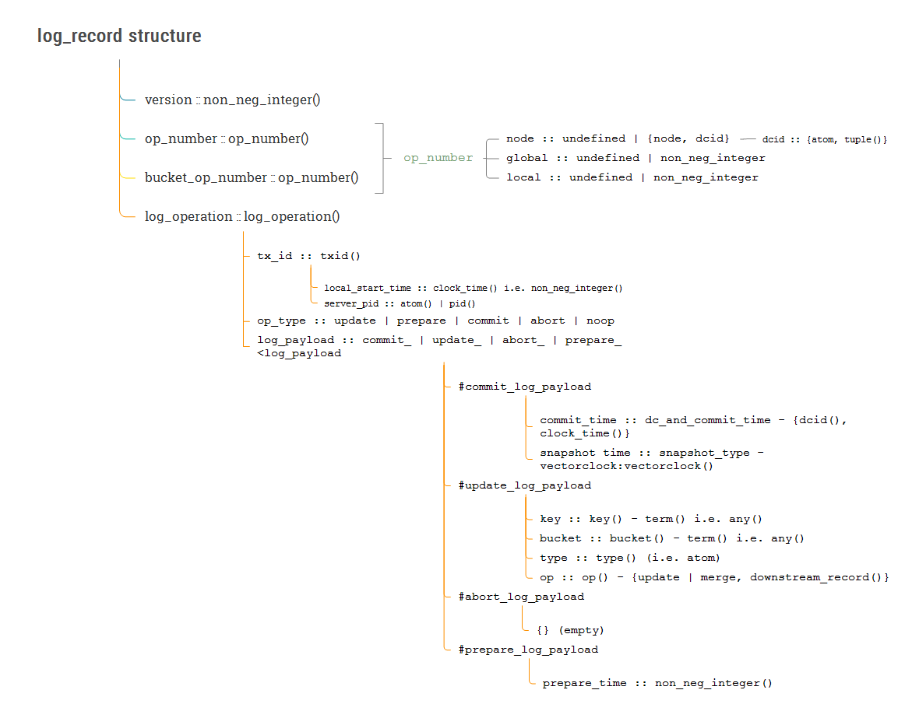

# Logs in Antidote

For each vnode in the ring, there exists one log file.

Currently the log is used for 3 things:

*  Loading the state of objects into the materialiser on restart (done by replaying the log).
*  Resending lost updates to external DCs.
*  Reading an older version of an object than what is available in memory.


Each log entry is defined by the following records:

```erlang
-type log_operation() :: #log_operation{}.
-record(log_operation, {
    tx_id :: txid(),
    op_type :: update
             | prepare
             | commit
             | abort
             | noop,
    log_payload :: any_log_payload()
}).


-type any_log_payload() :: #update_log_payload{}
                         | #commit_log_payload{}
                         | #abort_log_payload{}
                         | #prepare_log_payload{}.
-type commit_log_payload() :: #commit_log_payload{}.
-type update_log_payload() :: #update_log_payload{}.
-type op_number() :: #op_number{}.
-type op_name() :: atom().
-type op_param() :: term().
-type op() :: {op_name(), op_param()}.


-record(commit_log_payload, {
    commit_time :: dc_and_commit_time(),
    snapshot_time :: snapshot_time()
}).

-record(update_log_payload, {
    key :: key(),
    bucket :: bucket(),
    type :: type(),
    op :: op()
}).

-record(abort_log_payload, {}).

-record(prepare_log_payload, {prepare_time :: non_neg_integer()}).

-record(op_number, {
    node :: undefined | {node(), dcid()},
    global :: undefined | non_neg_integer(),
    local :: undefined | non_neg_integer()
}).
```


