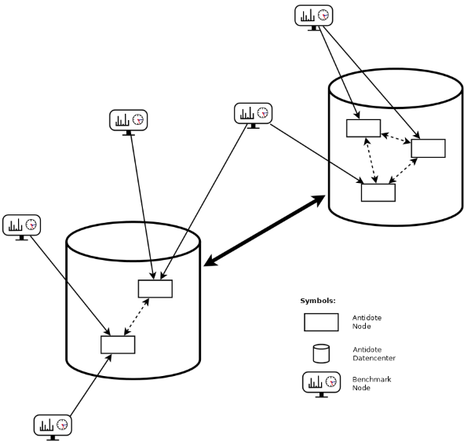

# Setup

This benchmark is build on the original benchmark for riak core called [basho_bench](https://github.com/basho/basho_bench).
Additional documentation on basho_bench can be found at [basho_bench_documentation](https://docs.riak.com/riak/kv/latest/using/performance/benchmarking).

A benchmark setup for antidote might look as follows:

## Prerequisites

- erlang (for example with [kerl](https://github.com/kerl/kerl))
- make
- git
- [r statistics language](https://www.r-project.org), to generate graphs

## Compile
For compiling from source code, clone the repository and use the make command.

- git clone https://github.com/AntidoteDB/Benchmarks
- cd Benchmarks
- make

The compiled basho_bench script is found at the path inside the Benchmark directory: 
- _build/default/bin/basho_bench

## Setup Antidote

Before you can run a benchmark you have to set up an Antidote cluster, or have access to an existing Antidote cluster.  
More information on how to deploy Antidote can be found at [AntidoteDB-documentation/deployment](https://github.com/AntidoteDB/AntidoteDB-documentation/tree/master/deployment).

## Usage

You may use the
- `make runbench` 

command, which will use the default results directory, which is the '/tests/' directory inside the repository. If it does not exist it will be created automatically.  

If you want to specify your own result directory and/or configuration file, edit the command as follows:
- `basho_bench --result-dir <results dir> <config file>`

## Results Directory

The defined results directory contains of benchmarking result folders, that are named as time stamps with the following format: 
- `YYYYMMDD_HHMMSS`, for example 20190702_091011

or 
- `current`, which is a link to the newest generated result directory

This time stamped directories contain:
- the used configuration file: e.g. antidote_pb.config
- logs for different log-level
- csv files (one summary.csv and maybe several *_latency.csv), which contain the collected data

## Generate Graphs

It is possible to make graphes out of generated csv files.

You can do this by using the following make commands:
- `make results`, which will build the summary graph for the current benchmarking result
- `make all_results`, to build the summary graphs of all benchmarking results contained in the results directory

You can also make these graphs outside of the repository. You only need the '/priv/' folder, as well as the folder containing the results (csv files):
- `Rscript --vanilla <priv/summary.r> -i <results-directory>`
