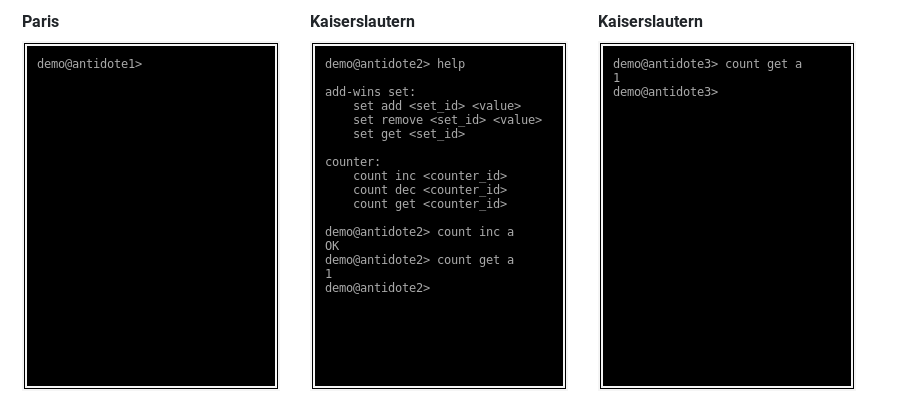

# Time Series Load Generator

A minimal Erlang script to simulate continuous time series data load to one instance of Antidote.

For usage and more information visit the [repository](https://github.com/albsch/antidote-timeseries-load-generator).

# Antidote Web Shell

A playground for Antidote.

An example is deployed in [Kaiserslautern and Paris](http://softech003.informatik.uni-kl.de:2378/).

To deploy it yourself and for more information visit the [repository](https://github.com/AntidoteDB/antidote-web-shell).

# Calendar App

A geo-replicated calendar application. 

See the [repository](https://github.com/AntidoteDB/calender-app) for more information.

# Todo List App

A CLI todo list using AntidoteDB as a backend.

See the [repository](https://github.com/shraddhabarke/antidote-todolist) for more information.
