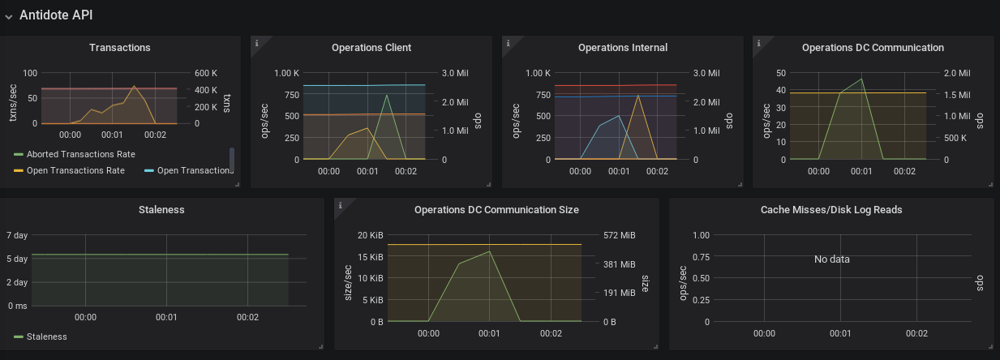
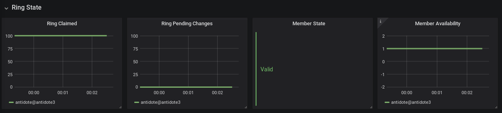
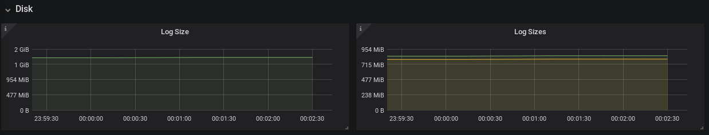
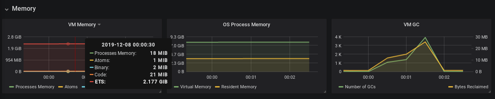
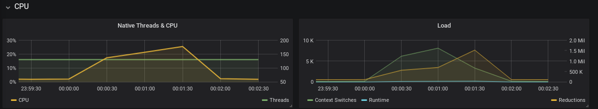
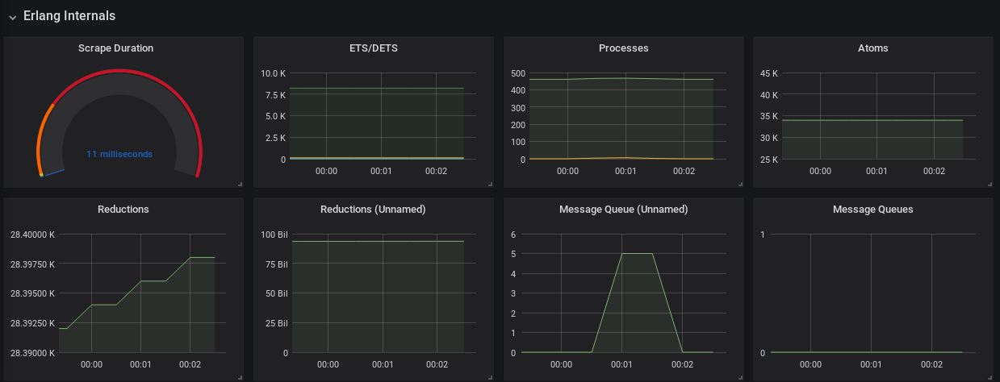

# Monitoring Antidote with Prometheus

Antidote is configured to expose metrics to [Prometheus](https://prometheus.io/) via the [antidote_stats module](https://github.com/AntidoteDB/antidote_stats).

Follow the steps in the `README` of the `antidote_stats` module to start the required monitoring services:

```bash
cd monitoring
docker-compose up -d
```

This starts a prometheus server and a grafana database.
If the containers started with no problems, open
`http://localhost:9090/targets` in a web-browser. 
You will see the targets prometheus is configured to monitor.
To change or add additional Antidote nodes, follow the necessesary steps in the README to [add targets to the prometheus configuration](https://github.com/AntidoteDB/antidote_stats).

To shutdown containers:
`docker-compose down`


# Grafana GUI

To view the monitoring data of antidote, open the Grafana Dashboard.
With default the configuration open the URL `http://localhost:3000` and log in with user `admin` and password `admin`.

The monitoring system provides information for the following metrics: Antidote API, Antidote Ring Structure, Antidote Log Size (disk usage), Memory, I/O, CPU, and Erlang Internals.

### Antidote API

Antidote has client, internal, and inter-dc operations which are monitored separately.
Addionally, transactions are tracked.




### Antidote Ring Structure

We use `riak_core` as a main dependency to provide sharding and means of distributing the log. 
The current state of the ring can be seen in the `Ring State` section and should be checked when setting up the nodes for the first time or look for outages of nodes in a DC.




### Antidote Log Size

To know how much disk space Antidote is using, log sizes are monitored.

To check for unusually active vnodes, the log sizes of every vnode is checked, too.




### Memory, I/O, CPU, Erlang Internals

Additional host metrics are provided. These include memory usage, network I/O, CPU usage, and Erlang internal metrics.









# Adding Metrics to Antidote

To add a metric collection call to the Antidote source code, use the macro `?STATS(term)`, 
where `term` is the term to send to the stat collector process.
The actual Prometheus processing is done in the `antidote_stats` module and every term should be implemented there.
Unknown terms which are not yet supported are logged during runtime, but will not crash the system.

