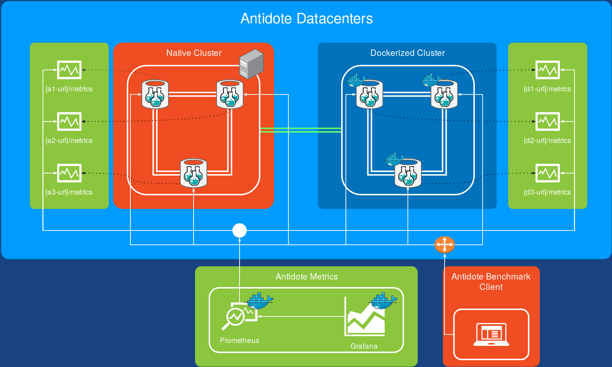
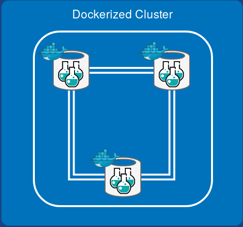

In this tutorial we are going to create an Antidote cluster, monitor it, and benchmark the performance of the cluster.

At the end, you will have the following configuration:

# Antidote Cluster Setup

In this section we are going to create a production-ready Antidote cluster setup.
Our goal is to create two data centers with three nodes each.
One data center (**DC1**) is fully dockerized, on the other one (**DC2**) we are going to install Antidote natively.
Finally, we monitor the two data centers with a Grafana dashboard specially tailored for monitoring Antidote clusters.

## Dockerized Data Center **DC1**

We want to connect three Antidote nodes together. 
The resulting setup should look like this:

There are multiple ways of instantiating Antidote docker nodes. 
We choose a `docker-compose` file configured to create a 3-nodes data center on the same physical machine.

