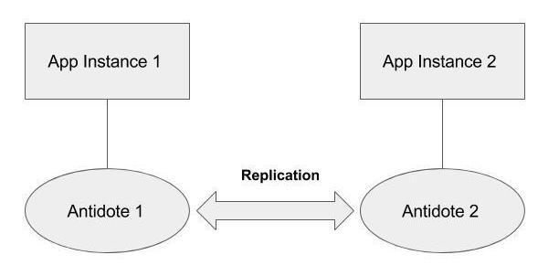

# Java Client

As a running example, we use a collaborative editing application where multiple users can concurrently update a shared todo list. We discuss how Antidote handles conflicting updates by multiple users based on its CRDT data model.

## Requirements

* Build AntidoteDB using [Docker](https://docs.docker.com/install/) (see [AntidoteDB Docker Deployment](deployment/docker.md))
* Clone the [Todolist application](https://github.com/shraddhabarke/antidote-todolist) from github and follow the setup instructions from README.
* Model data of Java application in AntidoteDB
* Update and read CRDT objects in AntidoteDB 
* Run two AntidoteDB nodes concurrently 
* Test the behavior of CRDT objects under concurrent access.

## Connecting to AntidoteDB

Before getting into the details of data modelling of the application in Antidote, we look at how to run the application commands on top of Antidote. We start two AntidoteDB node instances and run two separate application instances on top of each node. This enables us to see how Antidote tackles inconsistencies arising due to concurrent updates in different replicas.

Start two antidote node instances using the start\_antidote script in setup folder.

```bash
./start_antidote.sh
```

In two separate terminals, start two application instances on the antidote nodes:

```bash
./app1.sh
./app2.sh
```

Now connect to antidote on each of the terminal:

```bash
connect antidote1 8087
connect antidote2 8087
```

We now have an AntidoteDB cluster with two replicas!



## Running the Application

The application commands for interacting with Antidote can be found in the application README

Antidote resolves conflicts by giving preference to update operations over delete operations. This is referred to as add wins semantics. In case of a register data type, the latest update gets priority, intuitively called the last writer wins semantics. Throughout the application model, we follow add wins and last writer wins semantics.

We simulate real world network partition between two replicas of AntidoteDB. Here, we mimic two users running the application in terminal 1 and terminal 2. Initially the two replicas are connected and Antidote replicates data across them. In case of a network failure, Antidote will resolve conflict according to add wins and last writer wins semantics.

Create a new board with name “boardname” in terminal 1. A unique boardid is returned which is later used to perform operations on the board.

```bash
createboard boardname
```

Now, run the disconnect script that disrupts the communication between the two replicas. This simulates the disconnect which might happen due to network failuers. Now the scenario is equivalent to two users performing operations concurrently.

```bash
./disconnect.sh
```

Rename the board previously created, replacing board\_id in the command with the id returned.

```bash
renameboard board_id newnamet1
```

Rename the same board to a different name using terminal 2.

```bash
renameboard board_id newnamet2
```

Run getboard command on both terminals, the outputs are as follows



```bash
Board Name - newnamet1
List of Column Ids - []
List of Columns - []
```



```bash
Board Name - newnamet2
List of Column Ids - []
List of Columns - []
```



Run the connect script to re-connect and sync up both the replicas! Antidote gets conflicting updates and tries to resolve them using the CRDT datatypes.

```bash
./connect.sh
```

The output of getboard command for both terminals is now:

```bash
Board Name - newnamet2
List of Column Ids - []
List of Columns - []
```

The renameboard operation on terminal 2 was performed after the renameboard operation on terminal 1. Since the boardname is stored in a last writer wins register, the latter operation gets preference while resolving the conflict.

## Application Requirements <a id="application-requirements"></a>

The collaborative todo list application can be used by multiple users concurrently. It constitutes a board that serves as a workspace for adding tasks to be performed.

```text
public BoardId createBoard(AntidoteClient client, String name) {
  BoardId board_id = BoardId.generateId();                                                       //(1)
  MapKey boardKey = boardMap(board_id);                                                          //(2)       
  boardbucket.update(client.noTransaction(), boardKey.update(namefield.assign(name)));           //(3)
  return board_id;
}
```


Each of the columns on the board can have one or more than one task. A task has information such as title and its due date.

## Data Modelling in Antidote <a id="data-modelling-in-antidote"></a>

For modelling a complex data type with different fields we use a map datatype. The different fields can be register datatype in case of a single entity and set datatype in case of a list.

The **Board** object is a map with a unique board id that returns relevant information about the board using the getboard method. The Java **UUID** class that generates universally unique identifiers is used to get unique IDs for the application. Each **Board** object has a name and a list of column ids associated with it.

```bash
Boards
  ┗━━━ BoardId
          ┣━━━ name: Register<String>
          ┗━━━ columns: Set<ColumnId>
```

Similar to the **Board**, the **Column** object is a map with column id as the key. The unique column id returns fields related to a particular column such as name, tasks inside the column and board\_id associated with the column. To give preference to the latest update, the column name and board id are of type last writer wins register. The tasks field is a Set.

```bash
Columns
  ┗━━━ ColumnId
          ┣━━━ name: Register<String>
          ┣━━━ tasks: Set<TaskId>
          ┗━━━ board_id: Register<BoardId>
```

Each **Column** object has one or more **Task** objects. **Task** object is modelled as a map with task id as the unique key. The fields of a **Task** object consists of title, due date and the column id associated with the task.

```bash
Tasks
  ┗━━━ TaskId
          ┣━━━ title: Register<String>
          ┣━━━ due_date: Register<Date>
          ┗━━━ column_id: Register<ColumnId>
```

## Updating objects in Antidote

In Antidote, each object is stored in a Bucket. To create a bucket use the static bucket method:

```java
Bucket boardbucket = Bucket.bucket("board_bucket");
```

Objects in the AntidoteDB are addressed using a Key. To execute the update operation on a bucket, `Bucket.update` method is called. For performing several updates simultaneously, the `Bucket.updates` methods can be used. The update method takes a transactional context as the first argument. If the client has to perform a single update or read operation, `NoTransaction` can be used to execute an individual operation without any transactional context. The second argument of update method is an AntidoteDB Key which is explained in detail later in the section.

The code below illustrates a method to create a board in the application and rename it.

```java
public BoardId createBoard(AntidoteClient client, String name) {
  BoardId board_id = BoardId.generateId();                                                      
  boardbucket.update(client.noTransaction(),
                     map_aw(board_id.getId().update(register("name").assign(name))));           
  return board_id;
}
```

In line 2, the `generatedId()`method returns a unique **BoardId** object for each **Board** object.

The `getId()`method returns the uniqueID as a String. Since several objects are modeled as a map, it makes sense to have a method that generates an AntidoteDB MapKey corresponding to the map. Consequently, we have the following method that substitutes `map_aw(board_id.getId())` on line 4.

```java
public MapKey boardMap(BoardId board_id) {
  return map_aw(board_id.getId());
}
```

In order to reference the object in AntidoteDB, there is an an Antidote Key which consists of a CRDT type and the corresponding uniqueID key. It can be used as a top-level-key of an Antidote object in a bucket. The **MapKey** boardKey is used to update the contents of the **Map CRDT** boardMap in the database.

```java
MapKey boardKey = boardMap(board_id);
```

Also, `register(“name”)` in line 4 is replaced with `namefield` so that it constraints the type to `RegisterKey<String>`

```java
private static final RegisterKey<String> namefield = register("Name");
```

The code fragments above make the modified createBoard method more readable.

```java
public BoardId createBoard(AntidoteClient client, String name) {
  BoardId board_id = BoardId.generateId();                                                       
  MapKey boardKey = boardMap(board_id);                                                                
  boardbucket.update(client.noTransaction(), boardKey.update(namefield.assign(name)));         
  return board_id;
}
```

The update on `boardKey` creates an update operation to update CRDTs embedded inside the `boardMap`. The `createboard` method returns a unique id which can later be passed as an argument for the `renameBoard` method. Since the `namefield` is a register data type, `assign` is called to update the value.

```java
public void renameBoard(AntidoteClient
  client, BoardId board_id , String newName) {
  MapKey boardKey = boardMap(board_id);  cbucket.update(client.noTransaction(), boardKey.update(namefield.assign(newName)));
}
```

## Reading from Antidote <a id="reading-from-antidote"></a>

A Bucket has a read method that retrieves the current value of an object from database. `MapReadResult` presents the result of a read request on a Map CRDT. The entire object is read from database and individual fields can be obtained using get methods as illustrated by the following code:

```java
MapKey boardKey = boardMap(board_id);
MapReadResult boardmap = boardbucket.read(client.noTransaction(), boardKey);
String boardname = boardmap.get(namefield);
List<ColumnId> columnid_list = boardmap.get(columnidfield);
```

## Transactions <a id="transactions"></a>

The class `InteractiveTransaction` allows a client to execute multiple update and read before committing the transaction. It constitutes of a sequence of operations performed as a single logical unit. If the client has to perform a single update or read operation, the `NoTransaction` can be used to execute an individual operation without any transactional context.

The `moveTask` method deletes a task from one column and adds it to another column. It takes `ColumnId` of the new column and `TaskId` as arguments. `InteractiveTransaction` is called to ensure that the reads and updates are performed as a single unit. `InteractiveTransaction` guarantees that either the entire sequence of operation executes or none of them do. Hence we avoid the case in which the operation to delete a task from one column is performed but the operation to add a task to another is not.

```java
public void moveTask(AntidoteClient client, TaskId task_id, ColumnId newcolumn_id) {
    MapKey task = taskMap(task_id);
    try (InteractiveTransaction tx = client.startTransaction()) {                             
    ColumnId oldcolumn_id = columnbucket.read(tx, columnidfield);                         
    MapKey oldcolumnKey = new Column().columnMap(oldcolumn_id);                           
    columnbucket.update(tx, oldcolumnKey.update(Column.taskidfield.remove(task_id)));     
    MapKey newcolumnKey = new Column().columnMap(newcolumn_id);                          
    columnbucket.update(tx, newcolumnKey.update(Column.taskidfield.add(task_id)));        
        taskbucket.update(client.noTransaction(),task.update(columnidfield.assign(newcolumn_id)));
    tx.commitTransaction();                                                               
    }
}
```

Line 3 starts the transaction. The read method on the `columnbucket` in line 4 takes the transactional context `tx` created in line 1 as its first argument and reads the old `ColumnId`. In lines 5 and 7, `MapKey` `oldcolumnKey` and `newcolumnKey` are used to update the contents of the **Map CRDT** `columnMap` \(similar to `boardMap`\) in the database. Line 6 removes the Task Id from the `oldcolumnKey` and line 8 adds the `TaskId` to `newcolumnKey`. On line 10, the transaction is committed by calling `commitTransaction`.

